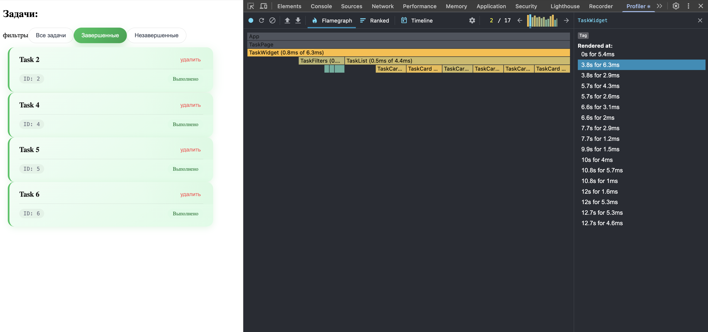
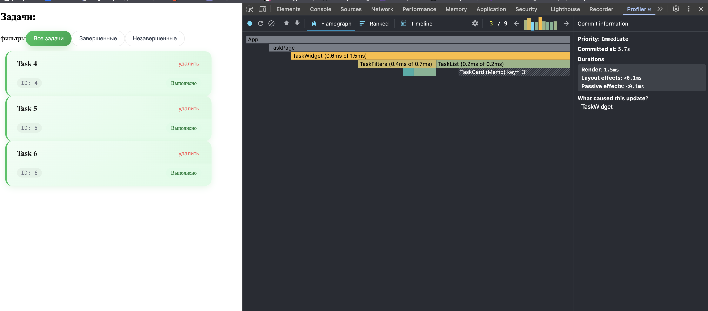
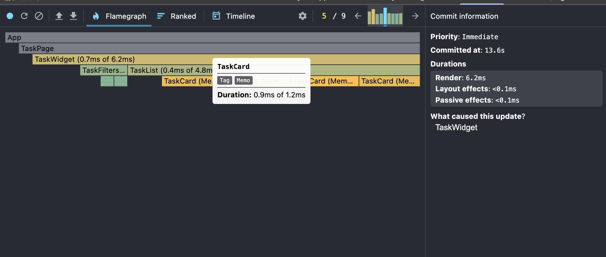

# React + TypeScript + Vite

2 задание

Что улучшили:

- время рендера комопнента WidgetList в среднем в 4 раза
- уменьшилось количество ререндеров
- компонент TaskList перешел в зеленую зону при рендере
- TaskCard мемоизированные и не перерендериваются

Что осталось:

- TaskWidget перерисовывается при смене фильтррв
- TaskFilters перерисовывается при удалении задачи, хотя фильтры не должны часто перерисовываться
